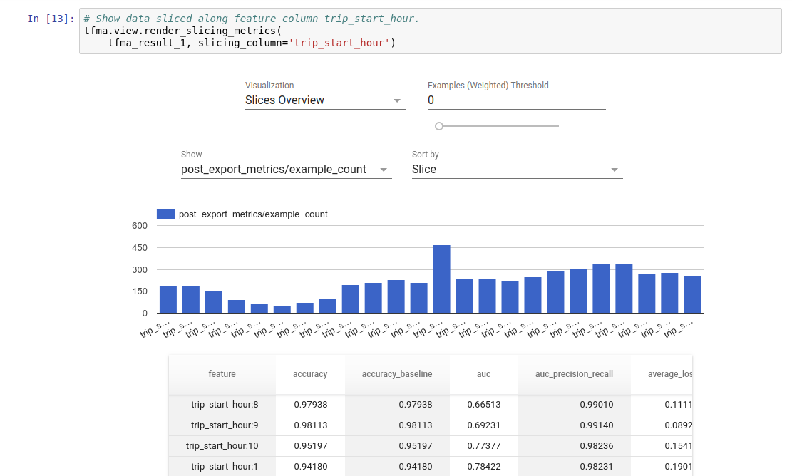

# Getting Started with TensorFlow Model Analysis

This guide introduces the basic concepts of TensorFlow Model Analysis (TFMA) and
how to use them with some examples.

## High-level Overview of TFMA

At a high-level, TFMA allows you to export your model's *evaluation graph*, that
is, the graph used for *evaluation* (as opposed to the graph used for *training*
or *inference*) to a special SavedModel, which we call the *EvalSavedModel*.
This *EvalSavedModel* contains additional information which allows TFMA to
compute the same evaluation metrics defined in your model in a distributed
manner over a large amount of data, and user-defined slices.

## Instrumenting an Existing Model

To use your an existing model with TFMA, you must first instrument the model to
export the *EvalSavedModel*. You can do this by adding a call to
`tfma.export.export_eval_savedmodel`, which is analogous to
`estimator.export_savedmodel`.

The following code snippet illustrates this:

```python
# Define, train and export your estimator as usual
estimator = tf.estimator.DNNClassifier(...)
estimator.train(...)
estimator.export_savedmodel(...)

# Also export the EvalSavedModel
tfma.export.export_eval_savedmodel(
  estimator=estimator, export_dir_base=export_dir,
  eval_input_receiver_fn=eval_input_receiver_fn)
```

You'll notice that you have to define an `eval_input_receiver_fn`, analogous to
the `serving_input_receiver_fn` for `estimator.export_savedmodel`. Like
`serving_input_receiver_fn`, `eval_input_receiver_fn` should define an input
example placeholder, parse the features from the example, and return the parsed
features. It should additionally parse and return the label.

The following code snippet illustrates how you might define an
`eval_input_receiver_fn`:

```python
country = tf.contrib.layers.sparse_column_with_hash_buckets('country', 100)
language = tf.contrib.layers.sparse_column_with_hash_buckets(language, 100)
age = tf.contrib.layers.real_valued_column('age')
label = tf.contrib.layers.real_valued_column('label')

def eval_input_receiver_fn():
  serialized_tf_example = tf.placeholder(
    dtype=tf.string, shape=[None], name='input_example_placeholder')

  # This *must* be a dictionary containing a single key 'examples', which
  # points to the input placeholder.
  receiver_tensors = {'examples': serialized_tf_example}

  feature_spec = tf.contrib.layers.create_feature_spec_for_parsing(
    [country, language, age, label])
  features = tf.parse_example(serialized_tf_example, feature_spec)

  return tfma.export.EvalInputReceiver(
    features=features,
    receiver_tensors=receiver_tensors,
    labels=features['label'])
```

There are two things to note here:

  *  `labels` can be a dictionary as well, which may be useful if you have a
      multi-headed model.
  *   While in most cases you will want your `eval_input_receiver_fn` to be
      mostly the same as your `serving_input_receiver_fn`, in some cases you may
      want to define additional features for slicing. For instance, you may want
      to introduce an `age_category` feature which divided the `age` feature
      into multiple buckets. You can then slice on this feature in TFMA,
      allowing you to understand how your model's performance differs across
      different age categories.

## Using TFMA to Evaluate Your Instrumented Model

TFMA allows you to perform large-scale distributed evaluation of your model by
using [Apache Beam](http://beam.apache.org), which is a distributed processing
framework. The evaluation results can then be visualised in a Jupyter Notebook
using the frontend components included in TFMA.



The quickest way to try it out is to use `tfma.run_model_analysis` to perform
the evaluation. Note that this uses Beam's local runner, so it's mainly for
quick small-scale experimentation locally. The following code snippet shows how:

```python
# Note that this code should be run in a Jupyter Notebook.

# This assumes your data is a TFRecords file containing records in the format
# your model is expecting, e.g. tf.train.Example if you're using
# tf.parse_example in your model.
eval_result = tfma.run_model_analysis(
  model_location='/path/to/eval/saved/model',
  data_location='/path/to/file/containing/tfrecords',
  file_format='tfrecords')

tfma.view.render_slicing_metrics(eval_result)
```

You can also compute metrics on slices of your data by configuring the
`slice_spec` parameter, and add additional metrics not included in your model
using `add_metrics_callbacks`. You can learn more by viewing the docstring for
`run_model_analysis`.

To perform distributed evaluation, you will have to construct a Beam pipeline
with a distributed runner. This requires you to have some familiarity with
[Apache Beam](http://beam.apache.org).

In your Beam pipeline, you can use the `tfma.EvaluateAndWriteResults` to
perform the evaluation and write the results out. The results can later be
loaded for visualization using `tfma.load_eval_result`. The following snippet
illustrates this:

```python
# To run the pipeline.
with beam.Pipeline(runner=...) as p:
  _ = (p
       # You can change the source as appropriate, e.g. read from BigQuery.
       | 'ReadData' >> beam.io.ReadFromTFRecord(data_location)
       | 'EvaluateAndWriteResults' >> tfma.EvaluateAndWriteResults(
            eval_saved_model_path='/path/to/eval/saved/model',
            output_path='/path/to/output',
            display_only_data_location=data_location))

# To load and visualize results.
# Note that this code should be run in a Jupyter Notebook.
result = tfma.load_eval_result(output_path='/path/to/out')
tfma.view.render_slicing_metrics(result)
```
